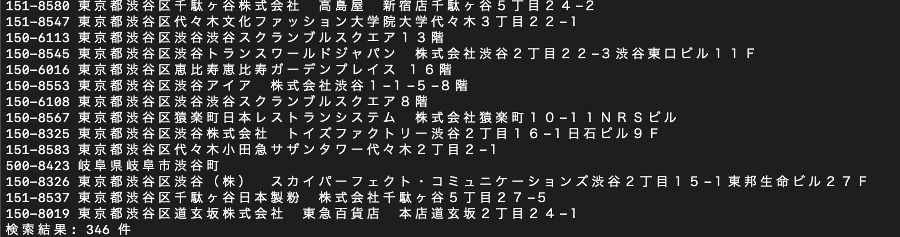

## 実行手順

### 1. zipファイルの解凍
zipファイルは以下のような構成になっています。

```
dist
┗ main_mac
┗ main_windows.exe
┗ main_ubuntu
picture
┗ ドキュメントで利用する画像
explain_execution.md
explain_technology.md
```

### 2. 環境別の実行ファイルを任意のディレクトリにコピー
1. macの場合
    - dist/main_mac

2. windowsの場合
    - dist/main_windows.exe

3. ubuntuの場合
    - dist/main_ubuntu

### 3. 実行ファイルを実行
※ 初回実行時は引数なしで実行してください
1. macの場合
    ```
    ./main_mac
    ```

2. windowsの場合
    ```
    ./main_windows.exe
    ```

3. ubuntuの場合
    ```
    main_ubuntu
    ```
---

実行すると以下のように表示されるので検索値を入力する


出力結果:


### 4. ２回目以降で全国.jpのcsvの更新が必要ない場合
`--search-only`という引数をつけて実行してください

1. macの場合
    ```
    ./main_mac --search-only
    ```

2. windowsの場合
    ```
    ./main_windows.exe --search-only
    ```

3. ubuntuの場合
    ```
    main_ubuntu --search-only
    ```