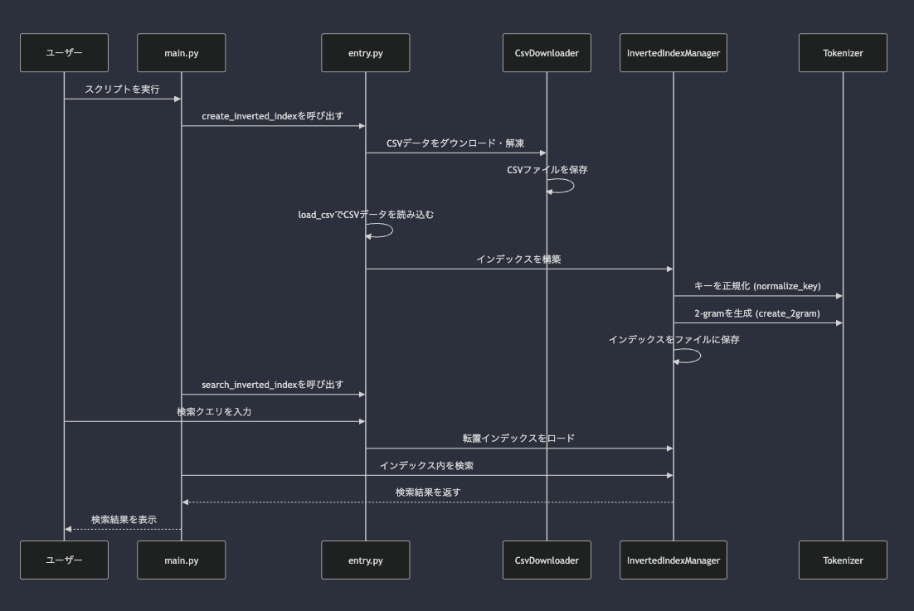

## 基本設計

### シーケンス図

### 詳細
本システムは以下のような方針で設計されています。

### 1. ユーザー操作の簡略化を重視した設計

- **エントリーポイントの統合**:  
   `main.py`にユーザーが行う操作を集約し、コマンドライン引数で動作を切り替えられるようにすることで、ユーザーが複数のスクリプトを実行する手間を省いています。たとえば、`--search-only`オプションを使用することで、インデックス作成をスキップして検索のみを実行できるようにしています。これにより、ユーザーは一つのスクリプトで全ての操作を完了させることが可能です。

- **インタラクティブな入力プロンプト**:  
   検索機能において、ユーザーはコマンドライン上で直接クエリを入力する形式になっており、操作が直感的で簡単です。ユーザーが迷うことなく操作できるように設計されています。

- **実行ファイルとしてのシステム提供**  
  `pyinstaller`を使用して、本システムを実行ファイル化しました。これにより、ユーザーはPython環境を整備する必要がなく、生成された実行ファイルをダブルクリックまたは、コマンドプロンプトから呼び出すだけでシステムを利用できます。`main.py`がエントリーポイントとなっており、ユーザーはその実行ファイルを通じてシステムの全機能（CSVのダウンロード、インデックス作成、検索）にアクセスできます。これにより、操作の簡便さとシステムのポータビリティが向上しました。

### 2. シンプルな設計

- **モジュールの明確な分割**:  
  システムは、`indexing`、`utils`、`log`といったモジュールに明確に分割されています。それぞれのモジュールが特定の機能を担当しており、コードの責務が明確です。これにより、コードの理解と保守が容易になっています。

- **統一された操作ロジック**:  
  インデックス作成や検索といった主要な機能が一貫したロジックで実装されており、コード全体がシンプルかつ直感的です。特に、`InvertedIndex`クラスが転置インデックスの作成・保存・検索の全てを管理することで、機能間の一貫性が保たれています。

### 3. テストを意識した設計

- **汎用的なデータ形式の採用**:
  `utils/csv_loader.py`において、CSVデータを`list[dict]`形式に変換しているため、データの取り扱いが非常に汎用的です。これにより、単体テストやモックを利用したテストが容易に行え、テストの信頼性が高まります。

- **シングルトンパターンの採用**:
  `LoggerSetup`クラスにシングルトンパターンを採用しており、全てのテストや実行環境で一貫したロギング設定を使用できます。このため、ログ関連のテストが単純かつ一貫性を保って行われるように設計されています。

- **テスト環境におけるファイル保存先の柔軟な指定**  
  `create_inverted_index`および`search_inverted_index`関数において、ファイルパスを引数として可変にすることで、テスト用の保存先ファイル名やディレクトリを柔軟に指定できるように設計しました。これにより、テスト環境と本番環境で異なるファイルパスを使用することが容易になり、テスト時に既存のデータを上書きするリスクを低減できます。また、テストの独立性が向上し、様々なシナリオでの検証が可能になります。

- **処理の分離**:
  csvダウンロード、csvデータ読込、インデックスの作成・検索といった処理がそれぞれ独立しているため、個別にテストを行うことが可能です。特に、`CsvDownloader`や`Tokenizer`のようなクラスは、その機能が明確であり、単体テストに向いています。

---

## 詳細設計

### main.py

- **本システムのエントリーポイント**
  - コマンドライン引数に応じて以下のいずれかを実行します
    1. 検索のみ(`--search-only`)
    2. 対象CSVのダウンロード + 転置インデックスの作成 + 検索

- **詳細**
  1. **検索操作のみ**
  2. **検索操作 + 転置インデックス作成操作**
  - ユーザーが行う操作が上記2通り考えられ、簡便さを重視し、専用のエントリーポイントを用意せずに、`main.py`に処理を集約しました。引数で動作を指定できるようにすることで、操作性を向上させています。

---

### indexing/entry.py

- **ユーザーの操作に応じて、転置インデックスの作成と検索を呼び出すためのモジュール**

### create_inverted_index

- **概要**
  - 住所.jpからCSVファイルをダウンロードし、転置インデックスを作成します。

- **詳細**
  - CSVの読み込みは同期的に行っています。非同期処理も検討しましたが、実行速度に大きな差がなかったため、保守性とコードの簡潔さを優先して同期処理を採用しました。
  - **処理手順**:
    1. 住所.jpからCSVをダウンロードします。
    2. `load_csv`関数を使用してCSVデータをロードします。
    3. `build`メソッドでインデックスを構築します。
    4. `save`メソッドでインデックスをPKLファイルに保存します。

#### search_inverted_index

- **概要**
  - 保存された転置インデックスファイルをロードし、ユーザーが入力したクエリに基づいて検索を行います。
  
- **詳細**
  - クエリ入力のコードを関数内に含めることで、検索操作を独立して実行できるようにしています。
  - **主な手順**:
    1. ユーザーから検索クエリを入力
    2. 転置インデックスデータをロード
    3. ロードしたインデックスからクエリに一致する行を検索（`search`メソッド）
    4. 結果を表示

---

### indexing/indexing/InvertedIndex

- **転置インデックスの構築から検索処理までを担当するクラス**

#### __init__

- **概要**
  - 転置インデックスの初期化を行います。初期化時に既存のインデックスをロードすることはないため、既存のインデックスファイルが存在する場合、明示的に`load`メソッドを実行する必要があります。

### build

- **概要**
  - リスト形式の辞書（`list[dict]`）から転置インデックスを作成します。

- **詳細**
  - 住所や地名を正規化し、トークンに分割するプロセスを採用しており、これによりタームと検索値の一貫性を確保しています。
  - ポスティングリストに行番号ではなく、実際のデータ項目を保存することで、CSVから対象行を探す処理を省略しています。
  - 単一の項目値（例: 曙、北、東など）は、それ自体が検索値として利用される可能性があるため、別途パディングを施し、単一文字列の検索にも対応しています。
  - `Tokenizer`クラスを使用して住所や地名をトークンに分割し、それをキーとして転置インデックスを構築します。
  - 具体的には、住所の要素（都道府県、市区町村、町域など）を結合し、これらを基にインデックスを作成します。

### save

- **概要**
  - 転置インデックスデータをpickleを使ってシリアライズし、指定したファイルに書き込みます。

- **詳細**
  - インデックスファイルのデータサイズが大きくなることや、ユーザーが直接インデックスファイルを確認するニーズが少ないことを考慮し、シリアライズ化して保存しています。

#### load

- **概要**
  - pickleを使って転置インデックスファイルをデシリアライズし、オブジェクトとして復元します。

### search

- **概要**
  - クエリをトークン化し、転置インデックスから一致する項目を検索します。クエリに含まれるトークンがインデックス内で一致するものをすべて取得し、その交差結果をセット形式で返します。

- **詳細**
  - クエリを正規化してトークンに変換し、そのトークンを基に転置インデックスを検索します。
  - 現状では「大阪市梅田」のように一部の住所情報が欠けたクエリの場合、検索結果が得られないことがあります。
    - **改善案**: 転置インデックスに連続していない項目の接頭・末尾の文字列を含めたトークンを作成し、検索精度を向上させることを検討します。
  - **手順**:
    1. クエリを正規化し、トークン（2-gram）に変換します。
    2. 各トークンを基に転置インデックスを検索します。
    3. トークンが複数ある場合、それぞれの検索結果の交差を取り、重複する項目のみを取得します。

---

### utils/csv_downloader/CsvDownloader

- **指定されたURLからZIP形式のCSVデータをダウンロードし、その内容をローカルに解凍・保存するクラス**

#### __init__

- **詳細**
  - `download`と`extract`の処理を分割するために`zip_content`をコンストラクタで定義しています。

#### download

- **概要**
  - 指定されたURLからZIPファイルをダウンロードし、その内容をバイト列として`zip_content`に保存します。

#### extract

- **概要**
  - ダウンロードしたZIPファイルを解凍し、指定されたディレクトリにCSVファイルを保存します。

---

### utils/csv_loader

- **住所.jpのCSVデータを`list[dict]`型に変換して出力するモジュール**
  - 汎用的なデータ型である`list[dict]`形式のデータを利用することで、テストの効率性を向上させています。

#### load_csv

- **概要**
  - 指定されたCSVファイルを読み込み、各行を辞書として格納したリスト形式で返す関数です。

- **詳細**
  - 処理速度を考慮し、以前は`DictReader`そのものを返していましたが、リスト形式に変換しても処理時間が増加しなかったため、テストに適したリスト形式を採用しました。
  - **処理の流れ**:
    1. 指定されたパスからCSVファイルを開きます。
    2. `csv.DictReader`を使用して、各行を辞書として読み込みます。
    3. すべての行をリストに格納して返します。

---

### utils/tokenizer/Tokenizer

- **トークンの作成と正規化を行うためのクラス**
   - 転置インデックスの作成と検索の両機能で本クラスを使用し、検索値とタームの一貫性を確保します。

#### create_2gram

- **概要**
  - 入力された文字列をトークンに分割します。

- **例**
  - "東京都" → ["東京", "京都"]
  - "東京" → ["東京"]
  - "東" → ["_東", "東_"]

- **詳細**
  - 文字列が1文字の場合（例：曙、甲、境など）でも検索に対応できるよう、文字列の前後に"_"を付けてからトークンに変換しています。

#### normalize_key

- **概要**
  - 文字列を全角に変換、小文字を大文字に変換、全角空白をアスタリスク（*）に置き換えます。

- **詳細**
  - アスタリスクに置き換えるのは、単一の項目値（例：曙 、東、北など）と区別するためです。
  - トークンとタームの双方を大文字・全角で正規化することで、検索結果の一貫性を確保しています。
  - 標準ライブラリを用いて全角に統一しようとした場合、カスタムマッピングを利用する必要があり、エラーのリスクが高まるため外部ライブラリを採用しました。
  - 以下の2つのライブラリを比較し、Snykでのスコアとスター数から`jaconv`を採用しました（2024/08/26現在）。
    - `jaconv`
      - [GitHub](https://github.com/ikegami-yukino/jaconv): 300 stars
      - [Snyk](https://snyk.io/advisor/python/jaconv)
    - `mojimoji`
      - [GitHub](https://github.com/studio-ousia/mojimoji): 142 stars
      - [Snyk](https://snyk.io/advisor/python/mojimoji)

---

### log/logger/LoggerSetup

- **ログ管理クラス**
   - 全エラーを継続不可にすることで、予期しない挙動を防ぐ
   (実行ファイルを渡す都合上、ユーザーが自らエラー修正を行うことは想定していません。)
   - ユーザーに表示するエラーをシンプルにすることで、ユーザーに配慮

#### __new__

- **概要**
  - シングルトンパターンの導入

- **詳細**
  - クラスのインスタンスが既に存在するかどうかを確認し、存在しない場合にのみ新しいインスタンスを作成します。これにより、アプリケーション全体で一貫したロガー設定が提供されます。

#### _initialize

- **概要**
  - ロガーの初期設定を行います。

- **詳細**
  - DEBUGレベル以上のすべてのログが処理され、ログはファイルに保存されます。

#### get_logger

- **概要**
  - 設定したロガーを返すメソッド

- **詳細**
  - アプリケーション内の任意の場所で同じロガーを使用することができます。

---

## 開発の流れ

### **1〜3日目**

#### 設計プランの比較検討と開発

1. インデックスファイルを事前に作成しないプラン
   1. ユーザーにCSVを保存してもらう
   2. インデックス構築用スクリプトを実行
   3. 検索用スクリプトを実行
   4. 検索値を入力
   5. 検索結果を表示

2. インデックスファイルを事前に作成するプラン
   1. 検索スクリプトを実行
   2. 検索値を入力
   3. 事前に保存された転置インデックスファイルを検索
   4. 検索結果を表示

| プラン  | CSV入力操作有無 | 事前ファイル定義有無 | 工数 |
| ------- | :--------------: | :-----------------: | :--: |
| プラン1 | ⚪︎              | ✖︎                  | 多   |
| プラン2 | ✖︎              | ⚪︎                  | 少   |

- プラン1では、CSV入力用のインターフェースが必要であり、工数が増加します。

以上の検討結果から、不明点の質問に対するご回答次第では余分な工数が発生する可能性があるプラン1ではなく、プラン2をベースに開発を行うことを決定しました。また、転置インデックスファイルを事前に作成してはいけない場合でも、システムにインデックス作成処理を追加できるよう、作成と検索をそれぞれ単独で実行可能な設計にしました。

### 4日目

#### **CSV取得処理と実行ファイルの作成**

疑問点に対していただいた回答:

> 1. **転置インデックスデータをソースコードに含めるべきか？**
>
>     → 検索を高速化するために作成する転置インデックスファイルは、gitにコミットせず、提出物にも含めないでください。
>
>   2. **スクリプトを読み込んで実行する方式に関して、実行環境にプログラミング言語の環境が整っていない可能性を考慮し、環境構築手順を実行手順に含めるべきか？**
>
>       → はい、環境構築手順も記載してください。

これらの回答を基に、転置インデックスファイルの作成をユーザー操作に含めるよう変更しました。

ただし、ユーザーにCSVを入力してもらうのではなく、requestsを使用してCSVファイルを取得する方が、ユーザーの手間を減らせると判断し、requestsによるデータ取得機能を追加しました。

さらに、開発の過程で、コンソールアプリケーションとして実装することで環境構築手順を簡略化し、ユーザーの入力手間をさらに減らせると考え、pyinstallerを使用して実行ファイルを作成しました。

### **5日目〜最終日**

#### 環境別の実行ファイルテストと各種ドキュメントの作成

以下のOS環境でpyinstallerを使用して実行ファイルを作成し、動作確認を行いました：

1. mac
   - M1 MacBook Air
2. Windows
   - Windows 11
3. Ubuntu
   - latest(v 24.04)
   - Dockerにて仮想環境を構築（dockerfile参照）

---

## 要件定義
### 1. **プログラムの機能要件**
   - **住所検索機能**: ユーザーが特定の単語を入力すると、その単語に一致する住所をリストとして返すプログラムを作成すること。
   - **高速な検索**: 高速な検索を実現するために、**転置インデックス**（Inverted Index）を使用して検索機能を実装する。
   - **N-gramの使用**: トークン分割（単語分割）アルゴリズムとして、**トークン**（N=2）を使用すること。

### 2. **入力データ要件**
   - **住所データ**: 住所データとして「住所.jp」の「全国」のCSVファイルを使用する。ファイルには、都道府県、市区町村、町域などの情報が含まれている。
   - **ファイルの取り扱い**: 住所データのCSVファイルをGitリポジトリにコミットしないようにする。

### 3. **検索の仕様**
   - **検索対象**: 入力文字列からトークンで作成される全てのトークンが、単一行の検索対象項目内に含まれる住所を検索結果として表示すること。
   - **検索項目**: 検索対象項目として、郵便番号以外の項目（都道府県、市区町村、町域、京都通り名、字丁目、事業所名、事業所住所）を使用すること。
   - **出力形式**: 検索結果には、「郵便番号」「都道府県」「市区町村」「町域」「京都通り名」「字丁目」「事業所名」「事業所住所」を表示すること。

### 4. **開発要件**
   - **プログラミング言語**: 開発言語に関する制限はない。
   - **実行方法**: スクリプトを直接読み込んで実行する形式（例：`python script.py`）または、コンソールアプリケーション、WEBアプリケーションとして実装しても良い。

### 5. **提出要件**
   - **提出物**: 開発したプログラムのソースコード、実行説明資料、技術説明資料をGitHubリポジトリへのリンクまたはZipファイルとして提出すること。
   - **実行説明資料**: プログラムの動作に必要な情報や手順を記述したドキュメントを含めること。
   - **技術説明資料**: コードの設計や、なぜその設計にしたかを説明したドキュメントを含めること。

### 6. **その他の要件**
   - **転置インデックスの利用**: プログラムは転置インデックスをファイルとして作成し、それに基づいて検索を行う形式で実装すること。
   - **スケーラビリティ**: 住所.jpデータの性質上、短期間に急激に増加することはないと考えられるため、シンプルな実装をすること。

